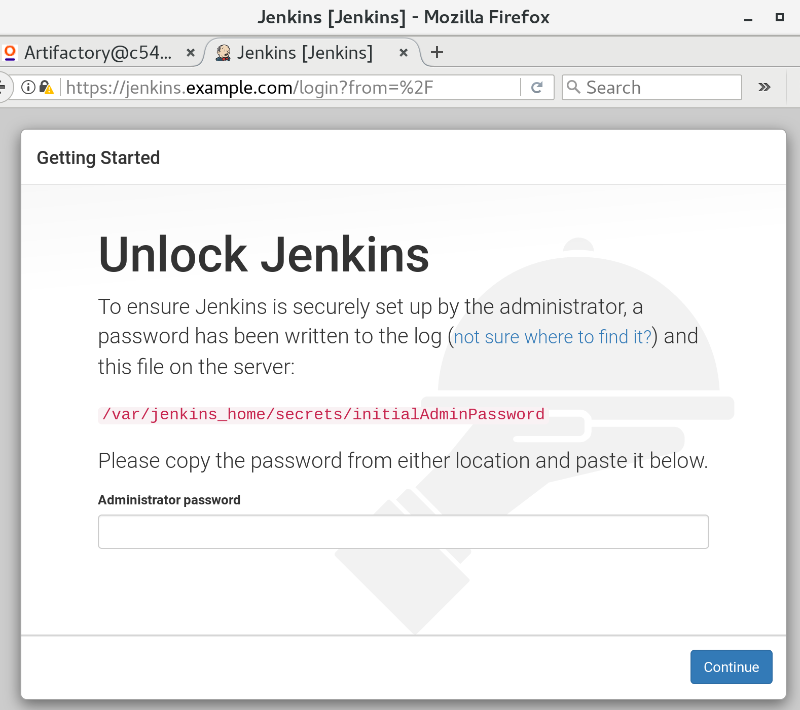
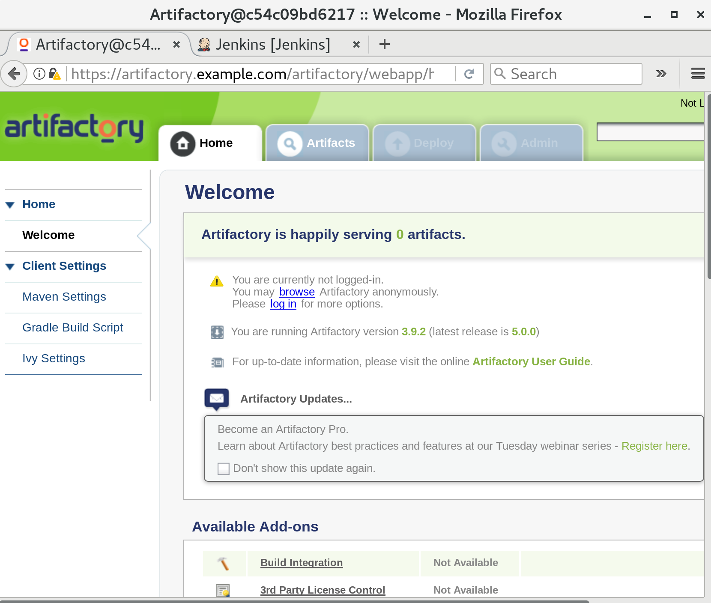

# CI (Continuous Integration) with HA-Proxy

# The itch:
When I setup Jenkins and Artifactory setup, why do I (always) have to use Apache, or Nginx as reverse proxy? :( Can there be something simpler? Can I use haproxy? Will it work? 

# The answer:
Yes. 

# Details
Yes, we can use haproxy as a reverse proxy for our docker application stack! It has a much simpler and cleaner configuration. No more cryptic apache or nginx configurations! Hurray!


## Setup:

The accompanying docker-compose.yml file brings up a very simple application suite consisting of Jenkins, Artifactory and HAProxy. It expects persistent storage, and it uses SSL for haproxy. That means haproxy is also the SSL terminator. The persistent storage and SSL are taken care of in the  `setup.sh` script. 

In this example setup HAProxy uses the host headers to differentiate between different types of requests, and it uses `example.com` for that. So we have `jenkins.example.com` and `artifactory.example.com` setup in haproxy. If you want to access this application suite by some other means , then you change those names in haproxy.cfg .
 
Then you need some way of pointing `jenkins.example.com`  and `artifactory.example.com` towards the machine where you are running this stack. If it is localhost (normally Linux PCs) then you can modify `/etc/hosts`. If it is somewhere else on some other virtual or physical machine, anywhere in the world (including VMs on your machines), you can either use `/etc/hosts` again, or have some other DNS mechanism in place.

## Preparation:
* Clone this repo to your computer. 
* Have docker and docker-compose installed on that computer.
* Run the `setup.sh`script . It creates necessary directory structure, creates SSL certs, and copies haproxy.cfg to persistent storage. (Though we can actually make it part of haproxy image). 


```
[kamran@dockerhost ci-with-haproxy]$ ./setup.sh 
This script will run as sudo ...

Creating directory structure under /opt/ci-with-haproxy

/opt/ci-with-haproxy
├── artifactory
│   ├── backup
│   ├── data
│   └── logs
├── haproxy
└── jenkins
    └── jenkins_home

7 directories

Creating self signed certificates in /tmp - in non-interactive mode ...

Generating RSA private key, 2048 bit long modulus
..............+++
........+++
e is 65537 (0x10001)
writing RSA key
Signature ok
subject=/C=NO/ST=Oslo/L=Oslo/O=Praqma/OU=IT/CN=*.example.com
Getting Private key

Creating a combined certificate and saving it as /opt/ci-with-haproxy/haproxy/haproxy.pem

Copy haproxy.cfg to /opt/ci-with-haproxy/haproxy/

Done.

You can start the application suite using docker-compose up -d

[kamran@dockerhost ci-with-haproxy]$
```


**Note:** You can run setup.sh multiple times, even if artifactory and jenkins are already running and have already created their home directories and all that. The script simply tries to create the directories and chmod 1000:1000 on them. If the directories are already there, it simply fails (silently for those commands. 


## Run the application:
When ready, bring up the application suite using `docker-compose up -d`


```
[kamran@dockerhost ci-with-haproxy]$ docker-compose up -d
Creating network "ciwithhaproxy_default" with the default driver
Pulling haproxy (haproxy:1.7)...
Trying to pull repository docker.io/library/haproxy ... 
sha256:32be2bd1ec0e8cea7a990e18bd0069b09f23781e9004b20cd7e473b23e146f23: Pulling from docker.io/library/haproxy
5040bd298390: Already exists
63408554ba61: Already exists
3ea5adf19ff4: Pull complete
Digest: sha256:32be2bd1ec0e8cea7a990e18bd0069b09f23781e9004b20cd7e473b23e146f23
Status: Downloaded newer image for docker.io/haproxy:1.7
Pulling artifactory (mattgruter/artifactory:latest)...
Trying to pull repository docker.io/mattgruter/artifactory ... 
sha256:85e3748026700065aafab4753f0214ccd43e99951c57dda2a33d4ed0ad57265a: Pulling from docker.io/mattgruter/artifactory
5040bd298390: Already exists
fce5728aad85: Pull complete
c42794440453: Pull complete
9e53c91deee9: Pull complete
4eb6a09786b9: Pull complete
Digest: sha256:85e3748026700065aafab4753f0214ccd43e99951c57dda2a33d4ed0ad57265a
Status: Downloaded newer image for docker.io/mattgruter/artifactory:latest
Creating ciwithhaproxy_haproxy_1
Creating ciwithhaproxy_artifactory_1
Creating ciwithhaproxy_jenkins_1
[kamran@dockerhost ci-with-haproxy]$
```

## Check status:

```
[kamran@dockerhost ci-with-haproxy]$ docker-compose ps
           Name                          Command               State                    Ports                   
---------------------------------------------------------------------------------------------------------------
ciwithhaproxy_artifactory_1   catalina.sh run                  Up      8080/tcp                                 
ciwithhaproxy_haproxy_1       /docker-entrypoint.sh hapr ...   Up      0.0.0.0:443->443/tcp, 0.0.0.0:80->80/tcp 
ciwithhaproxy_jenkins_1       /bin/tini -- /usr/local/bi ...   Up      0.0.0.0:50000->50000/tcp, 8080/tcp       
[kamran@dockerhost ci-with-haproxy]$ 
```

```
[kamran@dockerhost ci-with-haproxy]$ docker ps
CONTAINER ID        IMAGE                    COMMAND                  CREATED             STATUS              PORTS                                      NAMES
10ee02b39703        ciwithhaproxy_jenkins    "/bin/tini -- /usr/lo"   About an hour ago   Up About an hour    8080/tcp, 0.0.0.0:50000->50000/tcp         ciwithhaproxy_jenkins_1
968f0cc62506        mattgruter/artifactory   "catalina.sh run"        About an hour ago   Up About an hour    8080/tcp                                   ciwithhaproxy_artifactory_1
2f0bf010ca87        haproxy:1.7              "/docker-entrypoint.s"   About an hour ago   Up About an hour    0.0.0.0:80->80/tcp, 0.0.0.0:443->443/tcp   ciwithhaproxy_haproxy_1
[kamran@dockerhost ci-with-haproxy]$ 
```


## Access from browser:






Enjoy!
